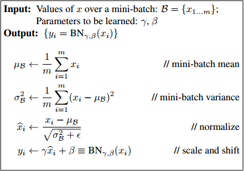
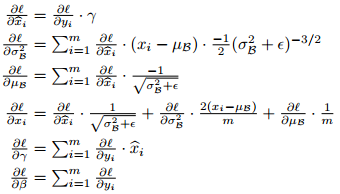

# 1.环境安装遇到的问题

- 用pip安装gnureadline报错

  原因：缺少libncurses包

  ```shell
  sudo apt install libncurses5-dev
  ```

- 运行jupyter notebook，总是遇到The kernel has died, and the automatic restart has failed

  解决办法：

  ```shell
  pip3 install --upgrade ipykernel
  ```

- 升级xserver-xorg-input-all后重启电脑键盘鼠标失灵

  解决办法：

  ```shell
  sudo apt install --reinstall xserver-xorg-input-all
  ```

  ​

# 2.程序问题

- 复杂求导（反向传播）如果不想出错，一定要用计算图！！计算图的模块尽量细分，比如1/x, x^2等等，但计算效率**可能**会低一点。

- ​Batch Normalization 求导: 

  


​                                                 ​ 

​	最开始没有看懂$x_i$的求导，同时采用**计算图**或者**一元函数链式法则**给把自己弄糊涂了，尽管能求，但是略复杂。实际上把loss看成$xi, \mu_B, \sigma_B^2$的函数，再利用多元函数链式法则即可。

​	**多元函数链式法则**：

​	令$z=f(x, y)$, 其中$x=g(t), y=h(t)$，$g(t)$和$h(t)$是可微函数，则：

​	$$\frac{dz}{dt} = \frac{\partial z}{\partial x} \frac{dx}{dt} + \frac{\partial z}{\partial y}\frac{dy}{dt}$$

​	这样看，$\frac{\partial l}{\partial x_i}$就很好理解了。

- x为一矩阵，mask为一个同型布尔值矩阵，x[mask]返回的是一个向量，但是x[mask] = 0这一操作是将x中mask对应为True的位置的值赋为0。

- 利用np.pad给第2维和第3维填充0：

  ```python
  >>> npad = ((0, 0), (1, 1), (1, 1))
  >>> np.pad(x, pad_width=npad, mode='constant')
  array([[[ 0.,  0.,  0.,  0.,  0.],
          [ 0.,  1.,  1.,  1.,  0.],
          [ 0.,  1.,  1.,  1.,  0.],
          [ 0.,  1.,  1.,  1.,  0.],
          [ 0.,  0.,  0.,  0.,  0.]],

         [[ 0.,  0.,  0.,  0.,  0.],
          [ 0.,  1.,  1.,  1.,  0.],
          [ 0.,  1.,  1.,  1.,  0.],
          [ 0.,  1.,  1.,  1.,  0.],
          [ 0.,  0.,  0.,  0.,  0.]]])
  >>> x.shape
  (2, 3, 3)
  >>> np.pad(x, pad_width=npad, mode='constant').shape
  (2, 5, 5)
  ```

- 多通道卷积操作：将每个通道的filter与图片对应通道的对应区域点乘然后**求和后再加b**(bias).


$$
\begin{align}
x_{i,j}^l &= \text{rot}_{180^\circ} \left\{ w_{m,n}^l \right\} \ast o_{i,j}^{l-1} + b_{i,j}^l \tag {6} \\
x_{i,j}^l &= \sum_{m} \sum_{n} w_{m,n}^l o_{i+m,j+n}^{l-1} + b_{i,j}^l \tag {7} \\
o_{i,j}^l &= f(x_{i,j}^l) \tag {8}
\end{align}
$$

- [‘Feedforward in CNN is identical with convolution operation’](https://grzegorzgwardys.wordpress.com/2016/04/22/8/#unique-identifier),  [‘Backpropagation also results with convolution’](https://grzegorzgwardys.wordpress.com/2016/04/22/8/#unique-identifier2)

- 矩阵求导维数相容原则：

  > 如果$x \in R^{m\times n}，f(x) \in R,$ 那么$\frac{\partial f(x)}{\partial x} \in R^{m\times n}$;
  >
  > 如果$x \in R^{m \times 1}, f(x) \in R^n$，那么$\frac{\partial f(x)}{\partial x} \in R^{n\times m}$

  ​